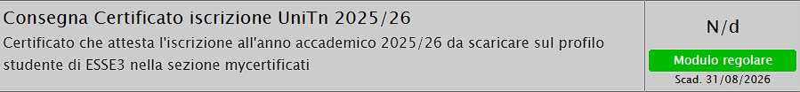
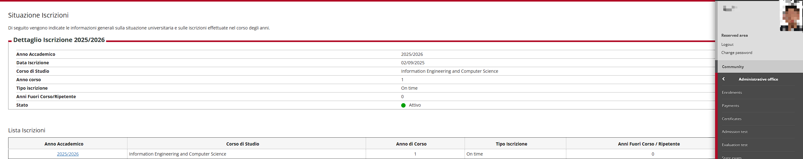

# 🧾 会员注册（UniTrento Sport） / Registration (UniTrento Sport)

注册链接：  
👉 https://www.unitrentosport-custrento.it/it/prenota/ / Registration link

---

## ✅ 1. 用户注册 / Account Registration  

- 按提示填写注册信息 / Fill in the form as instructed  
- 注意选择正确的用户类型 / Select the correct user type  
- PhD 可在 esse3 查看学号（Reserved area：MAT. xxxxxx） / PhD students can find the student ID in esse3 (Reserved area: MAT. xxxxxx)

---

## ✅ 2. 提交文件 / Document Submission  
以下材料通常需要上传：/ The following documents are usually required:

### ① 申请表 / Application form  

### ② 在学证明 / Enrollment proof  

- 网站：http://www.esse3.unitn.it/ / Website: http://www.esse3.unitn.it/  
- 登录后进入 **Menu → Administrative office → Enrolments** / After login: **Menu → Administrative office → Enrolments**  
- 按如下格式截图：/ Take a screenshot in the following format:

### ③ 带心电图(ECG)的健康证明 / Medical certificate with ECG  

**选择 1：** / **Option 1:**  
- Istituto Europeo per la Medicina Sportiva  
- 地址：via Degasperi 108/2, Trento / Address: via Degasperi 108/2, Trento  
- 电话：0461 934478 / Phone: 0461 934478  
- 费用：35 欧 / Fee: €35  

营业时间：/ Opening hours:  

**选择 2：** / **Option 2:**  
https://www.miagenda.it/prenota-visita-medica-centro-specialistico/insiemed-dott-paolo-crepaz/203  
费用：50 欧 / Fee: €50