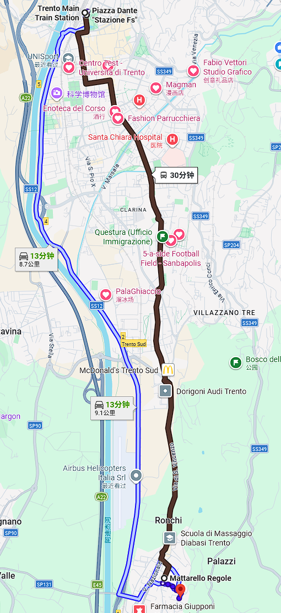
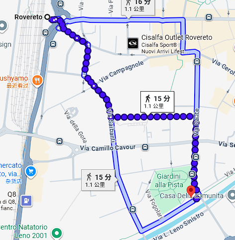

# 🎾 网球活动指南 / Tennis Guide

---

## 🏟️ 场地 1：Centro Universitario Sportivo Mattarello / Court 1: Centro Universitario Sportivo Mattarello
- 🌐 网站：https://unitrentosport.unitn.it/centro-sportivo-universitario-di-mattarello / Website: https://unitrentosport.unitn.it/centro-sportivo-universitario-di-mattarello
- 📍 地址：Via delle Regole, 38123 Mattarello TN / Address: Via delle Regole, 38123 Mattarello TN
- ☎️ 预定电话：0461 282303 / Booking phone: 0461 282303
- 💶 收费：6.5€/h（室外，冬季不可用）；7€/h（室内） / Fee: €6.5/h (outdoor, closed in winter); €7/h (indoor)
- ✨ 特点：室内场地，需提前预约 / Highlights: indoor court, booking required
- 🚍 交通：Trento 火车站 → 8 路公交，约 30 分钟 / Transit: Trento station → bus 8, about 30 minutes

---

## 🏟️ 场地 2：罗韦雷托新体育中心 / Court 2: Rovereto Sports Center
- 🌐 网站：https://www.custrento.it/services/centro-sportivo-di-rovereto-tennis-e-padel/ / Website: https://www.custrento.it/services/centro-sportivo-di-rovereto-tennis-e-padel/
- 📍 地址：V2PR+638 Rovereto, Provincia autonoma di Trento / Address: V2PR+638 Rovereto, Provincia autonoma di Trento
- ☎️ 预定电话：0464 6650599 / Booking phone: 0464 6650599
- 💶 收费： / Fee:
  - 1.5€/h（8:00 - 17:00） / €1.5/h (8:00 - 17:00)
  - 1€/h（15:00 - 23:00） / €1/h (15:00 - 23:00)
- ✨ 特点：红土场地，会员免费用球 / Highlights: clay courts, members can borrow balls
- 🚆 交通：Trento → Rovereto 区间列车 15–20 分钟；火车站步行 15 分钟 / Transit: Trento → Rovereto regional train 15–20 minutes; 15 minutes on foot from station

  
